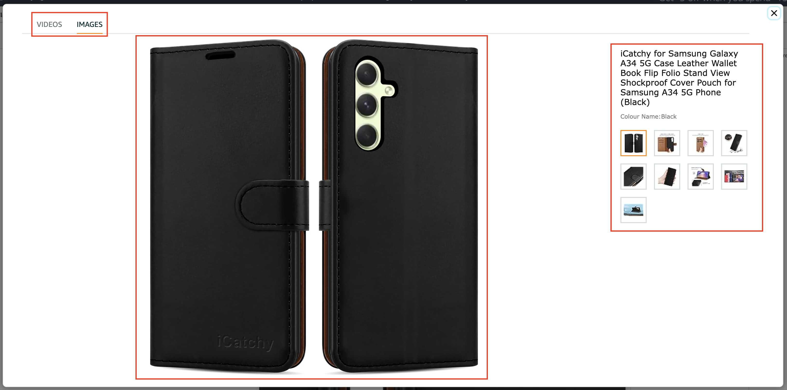
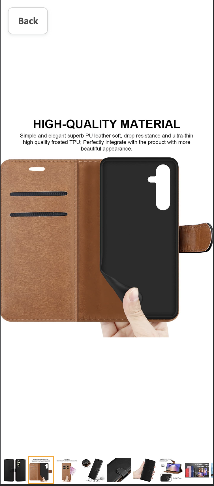

# Build Product Image Zoom feature In Vue/NuxtJS

## Overview
The Product Image Zoom feature enhances the user experience on an E-commerce website by allowing customers to interact with product images and videos. This feature is designed to work seamlessly across different screen sizes and devices.

## Key Features

### Supported Media Types
- **Multiple Images:** Users can view multiple images for a product and zoom in on them.
- **Multiple Videos:** Users can view and play multiple videos.

### Desktop Interaction
- **Image Hover:** Users can hover over product images to zoom in and get a closer look. 3 different images should be used: thumbnail version for thumbnails, standard image for the page and large version for zoom-in.
- **Slide Functionality:** Users can navigate between product images and videos using left and right arrows.
- **Thumbnails:** Thumbnails of images and videos are displayed on the product page for quick access, it can be shown horizontally or vertically.
- **Click to Open Image:** Clicking on a product image opens a pop-up viewer that displays the selected media.
- **Click to Open Video:** Clicking on a product video opens a pop-up viewer that plays the selected video.

### Mobile Interaction
- **Image:** 2 different images should be used: thumbnail version for thumbnails and large version for pop-up and double-tap.
- **Slide Functionality:** Users can navigate between product images and videos using left and right arrows.
- **Drag/Swipe Functionality:** Users can navigate between product images and videos by dragging/swiping left and right on image container.
- **Click to Open Image:** Clicking on a product image opens a pop-up viewer that displays the selected media.
- **Click to Open Video:** Clicking on a product video opens a pop-up viewer that plays the selected media.

### Pop-up Viewer
- **Tabs:** The pop-up viewer has two tabs: "Images" and "Videos" for easy navigation in Desktop and Mobile.

### Pop-up Viewer Desktop Interaction
- **Single Click:** Clicking an image in the pop-up viewer zooms in and out for closer inspection.
- **Thumbnails:** Thumbnails of images are displayed to switch between images.

### Pop-up Viewer Mobile Interaction
- **Thumbnails:** Thumbnails of images are displayed to switch between images.
- **Drag/Swipe Functionality:** Users can navigate between product images by dragging/swiping left and right on image container.
- **Double Tap:** Double-tapping on a particular area within an image in the pop-up viewer enables users to zoom in and out on that specific region for a closer inspection.

## Things to note:

- The code should be excutable from a terminal.
- Vue 2+ or Nuxt 2+ should be used.
- Please provide brief read me describing how to run your application.
- Should be built without the use of third party libraries.
- Please make sure this project is completed at least one working day before your interview.
- The completed project should be submitted by pushing the code to GitHub and a link emailed to HR.

### Screenshots

|  |
|:--:|
| *Image Hover feature* |

|  |
|:--:|
| *Image/Video Slide feature* |

|  |
|:--:|
| *Thumbnail feature* |

|  |
|:--:|
| *Pop-up viewer with Tabs feature* |

|  |
|:--:|
| *Pop-up viewer mobile feature* |