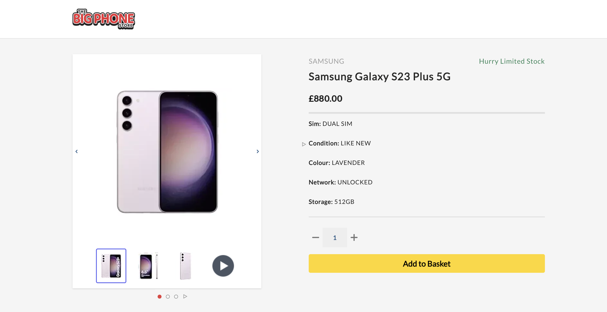
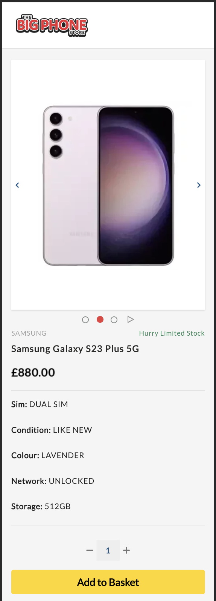
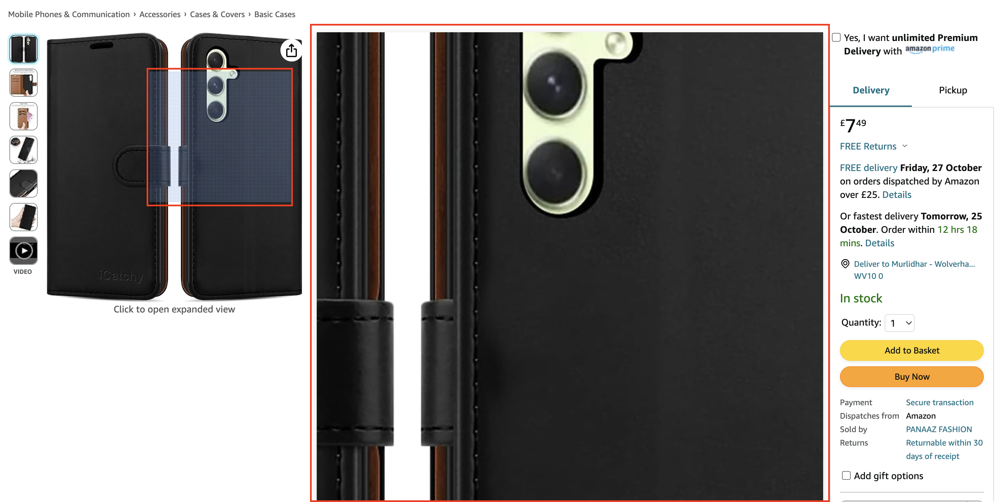
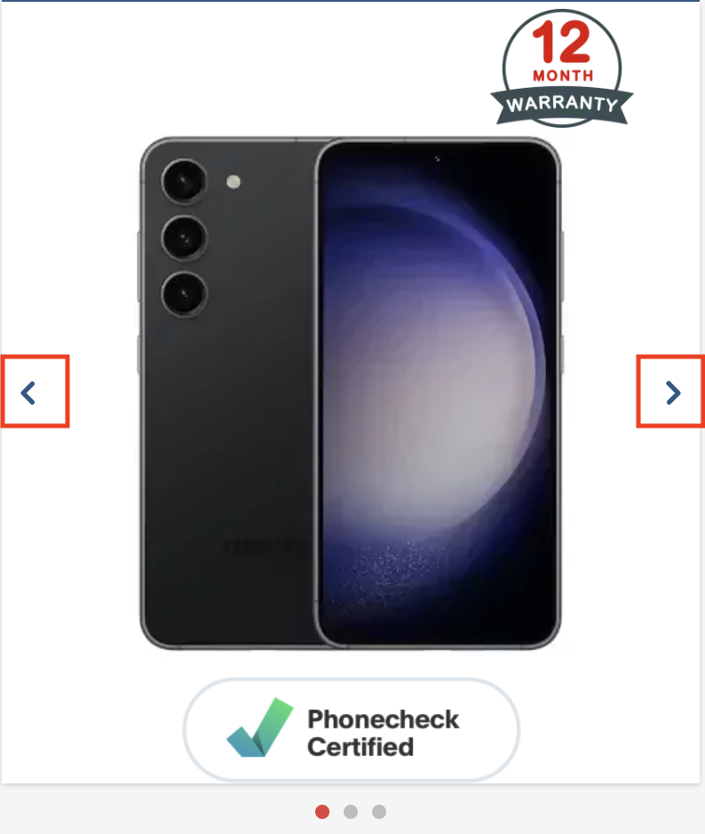
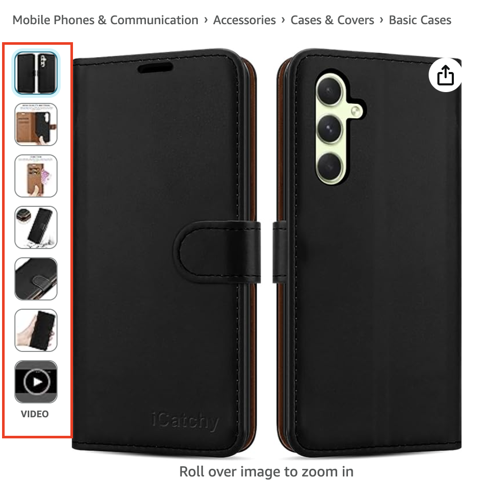
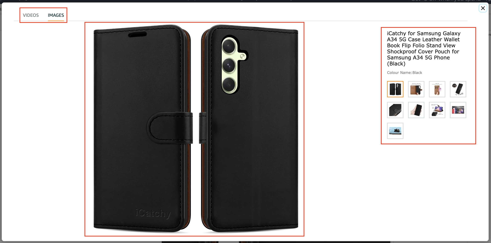
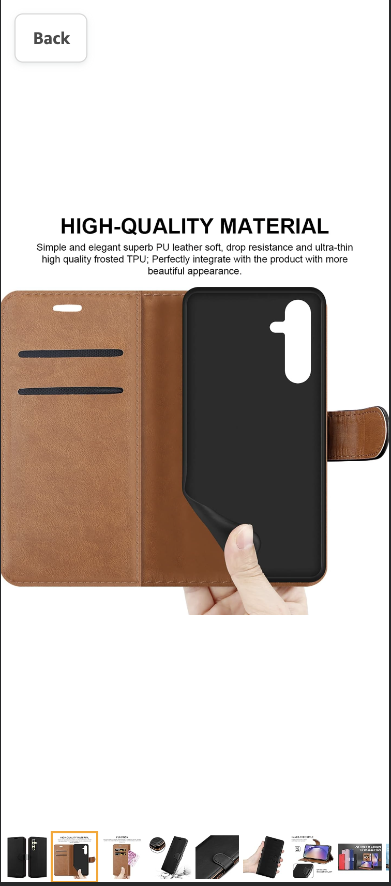

# Build Single Product Page with Image Zoom feature In Vue/NuxtJS

## Overview
The Single Product page with Image Zoom feature which enhances the user experience on an E-commerce website by allowing customers to interact with product images and videos is inspired from <a href="https://amazon.co.uk">Amazon ecommerce website</a>. This feature is designed to work seamlessly across different screen sizes and devices.

## Key Features

## Responsive Single Product Page
- **[Desktop view](#desktop-product-page-with-thumbnails):** Simple header with a company logo. Page containing product image zoom on left of the page and product info on the right.
- **[Mobile view](#mobile-product-page-without-thumbnails):** Simple header with all of the page sections stacked one below another.

## Product Image Zoom

### Supported Media Types
- **Multiple Images:** Users can view multiple images for a product and zoom in on them.
- **Multiple Videos:** Users can view and play multiple videos.

### Desktop Interaction
- **[Image Hover](#image-hover-with-lens-desktop):** Users can hover over product images to view zoomed in image and get a closer look. 3 different images should be used: thumbnail version for thumbnails, standard image for the main product placeholder and large version for zoomed-in image placeholder.
- **[Slide Functionality](#slider-with-arrows):** Users can navigate between product images and videos using left and right arrows.
- **[Thumbnails](#thumbnails-desktop):** Thumbnails of images and videos are displayed on the product page for quick access, it can be shown horizontally or vertically.
- **Click to Open Image:** Clicking on a product image opens a pop-up viewer that displays the selected media.
- **Click to Open Video:** Clicking on a product video opens a pop-up viewer that plays the selected video.

### Mobile Interaction Product Page
- **Image:** Hide thumbnails and show main product image placeholder.
- **[Slide Functionality](#slider-with-arrows):** Users can navigate between product images using left and right arrows (No videos in mobile view).
- **Drag/Swipe Functionality:** Users can navigate between product images by dragging/swiping left and right on image container.
- **Click to Open Image:** Clicking on a product image opens a pop-up viewer that displays the selected media.

### Pop-up Viewer
- **Tabs:** The pop-up viewer has two tabs: "Images" and "Videos" for easy navigation in Desktop (No tabs for mobile view, show only images no videos).

### [Pop-up Viewer Desktop Interaction](#pop-up-viewer-with-tabs-desktop)
- **[Single Click](#pop-up-viewer-single-click-zoom-desktop):** Clicking an image in the pop-up viewer zooms in and out for closer inspection.
- **Product Description:** Display product title and color on the right side.
- **Thumbnails:** Thumbnails of images are displayed on the right side below product description to ease navigation.
- **Close button:** Close button on the top right to close the pop-up.

### [Pop-up Viewer Mobile Interaction](#pop-up-viewer-with-thumbnails-mobile)
- **Thumbnails:** Thumbnails of images are displayed to switch between images.
- **[Drag/Swipe Functionality](#pop-up-viewer-drag-or-swipe-slider-mobile):** Users can navigate between product images by dragging/swiping left and right on the image container.
- **[Double Tap](#pop-up-viewer-double-tap-zoom-mobile):** Double-tapping on a particular area within an image in the pop-up viewer enables users to zoom in and out on that specific region for a closer inspection. When zooming in or out on the specific region, add a transition for a smooth user experience. View double-tap functionality on amazon website <a href="https://www.amazon.co.uk/UMIDIGI-G3-MAX-Smartphone-Extension-Dark-Blue/dp/B0C3B85FXK/?_encoding=UTF8&pd_rd_w=213Lp&content-id=amzn1.sym.444ba109-cdf8-4a96-9f01-f73a5ebc80ca%3Aamzn1.symc.adba8a53-36db-43df-a081-77d28e1b71e6&pf_rd_p=444ba109-cdf8-4a96-9f01-f73a5ebc80ca&pf_rd_r=RMRX75DXGD12JCQNDZ13&pd_rd_wg=2WbzI&pd_rd_r=8dfa5e6b-db4b-431b-9db1-ed94079a9090&ref_=pd_gw_ci_mcx_mr_hp_atf_m#immersive-view_1699955823897https://www.amazon.co.uk/UMIDIGI-G3-MAX-Smartphone-Extension-Dark-Blue/dp/B0C3B85FXK/?_encoding=UTF8&pd_rd_w=213Lp&content-id=amzn1.sym.444ba109-cdf8-4a96-9f01-f73a5ebc80ca%3Aamzn1.symc.adba8a53-36db-43df-a081-77d28e1b71e6&pf_rd_p=444ba109-cdf8-4a96-9f01-f73a5ebc80ca&pf_rd_r=RMRX75DXGD12JCQNDZ13&pd_rd_wg=2WbzI&pd_rd_r=8dfa5e6b-db4b-431b-9db1-ed94079a9090&ref_=pd_gw_ci_mcx_mr_hp_atf_m#immersive-view_1699955823897"><strong><underline>product</underline></strong></a> in mobile
- **Back button:** Back button on the top left to close the pop-up.

## Things to note:

- Assets can be found in the assets folder.
- The code should be executable from a terminal.
- Vue 2+ or Nuxt 2+ should be used.
- Tailwindcss should be used.
- Please provide brief read me describing how to run your application.
- Should be built without the use of third party libraries.
- Please make sure this project is completed at least one working day before your interview.
- The completed project should be submitted by pushing the code to GitHub and a link emailed to HR.

### Screenshots

#### Desktop Product Page with thumbnails
|  |
|:--:|
| *Desktop Product Page* |

#### Mobile Product Page without thumbnails
|  |
|:--:|
| *Mobile Product Page* |

#### Image Hover with lens (Desktop)
|  |
|:--:|
| *Image Hover feature* |

#### Slider with arrows
|  |
|:--:|
| *Image/Video Slide feature* |

#### Thumbnails (Desktop)
|  |
|:--:|
| *Desktop Thumbnail feature* |

#### Pop-up viewer with Tabs (Desktop)
|  |
|:--:|
| *Pop-up viewer with Tabs (Desktop) feature* |

#### Pop-up viewer with thumbnails (Mobile)
|  |
|:--:|
| *Pop-up viewer mobile with thumbnails feature* |

#### Pop-up viewer Single click zoom (Desktop)
|  |
|:--:|
| *Pop-up viewer single click zoom feature* |

#### Pop-up viewer Drag or Swipe slider (Mobile)
|  |
|:--:|
| *Pop-up viewer Drag or Swipe slider mobile feature* |

#### Pop-up viewer Double tap zoom (Mobile)
|  |
|:--:|
| *Pop-up viewer Double tap zoom mobile feature* |